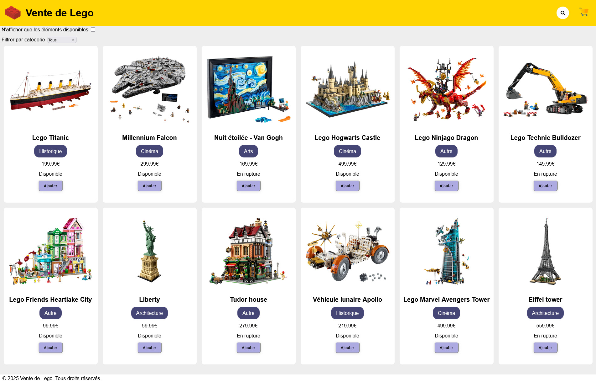

# 🧱 Lego Shop - Version Simplifiée

Bienvenue sur **Lego Shop**, une reproduction simplifiée de la boutique officielle Lego, développée avec **React**.

## 🚀 Objectifs

- Appliquer les fondamentaux de React (composants, props, state, events).
- Mettre en place une structure de boutique en ligne (affichage de produits, panier, filtrage).
- Gérer l’état global d’une application.
- Utiliser un design responsive simple.

## 🛠️ Technologies utilisées

- [React](https://reactjs.org/)
- [Vite](https://vitejs.dev/)
- CSS

## 📦 Fonctionnalités
🔍 Liste des produits avec nom, image et prix.

🛒 Ajout et suppression d’articles dans le panier.

🧾 Affichage du panier avec total dynamique.

📱 Interface responsive.

## 📸 Aperçu

## ✍️ Auteur
Projet réalisé par Simon Cassan dans le cadre d’un exercice React.  
***
  
*Ce projet est une reproduction pédagogique et non affiliée à Lego Group.*
